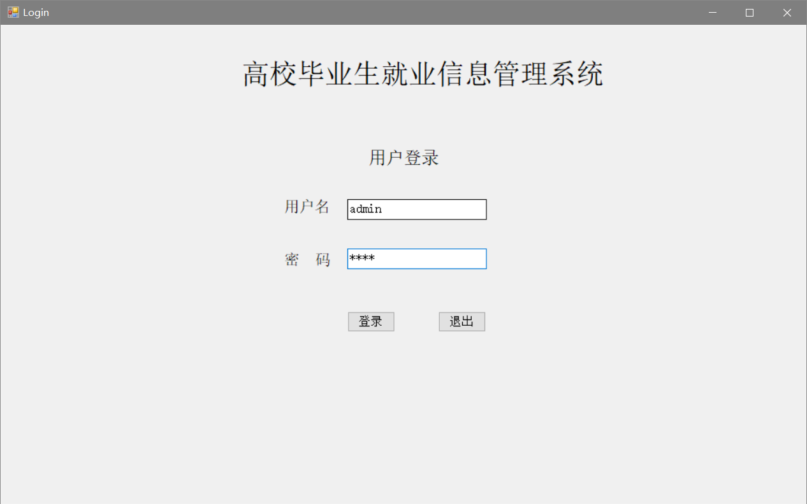
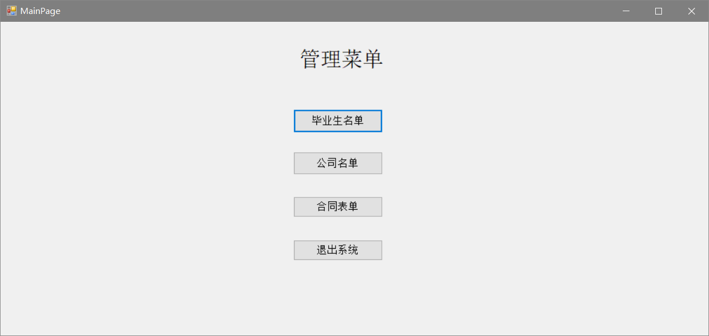
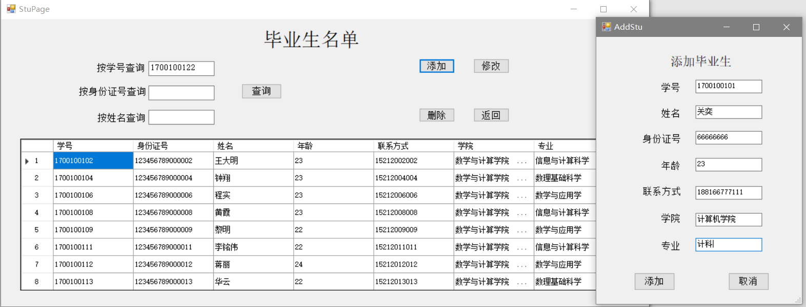
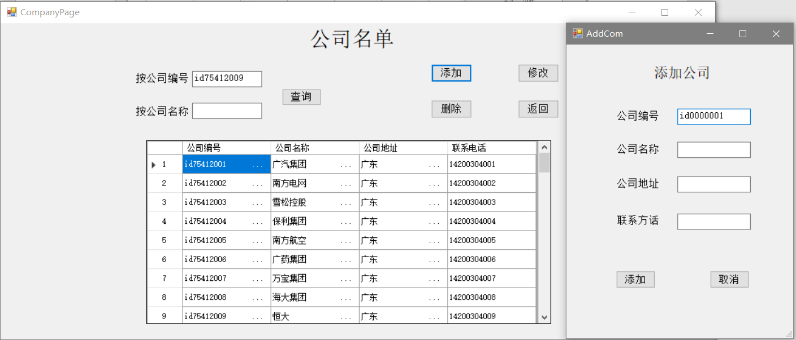
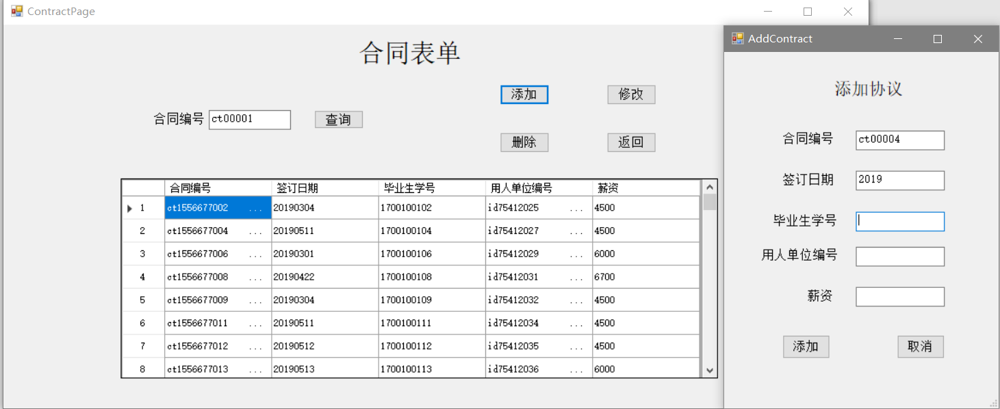

# StudentCompanyManageSystem
> 《简易的高校毕业生就业信息管理系统》

***

A simple manage system  winforms client bases on C#  which includes function :CRUD。

基于c#的winforms信息管理客户端，支持增删改查。

### #🈚🈚说明

**📃📃文件说明**

1. SCMSystem——系统源码
2. 数据库脚本.sql。

**🔨🔨工具说明**

1. SQL Server 2019
2. Microsoft Visual Studio 2019

### #🈚🈚系统组成

#### 1.登录

#### 2.菜单面板

#### 3.毕业生信息面板

#### 4.公司信息面板

#### 5.协议信息面板

***

> 备注：本系统作为数据库系统原理综合实验作业。
> 紧急出产的作品，信息操作部分，Bug挺多，不乱输入……………………（能跑）。

 

\#\#\#：📫什么？？您要pen？？😠😠

 

\#\#\#：那请到 👉issue👈 pen 清楚点。反正……我也不改了……😛😛

